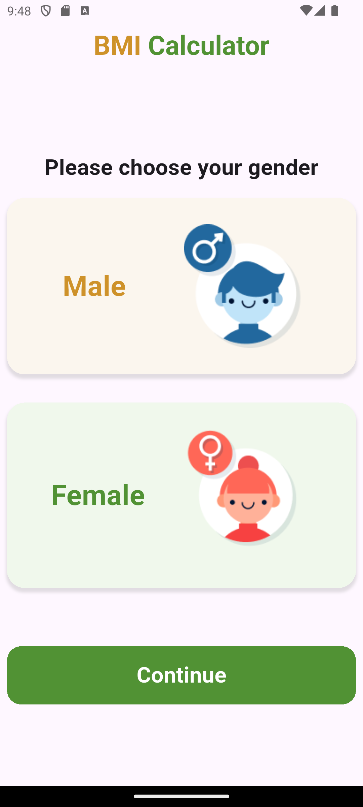
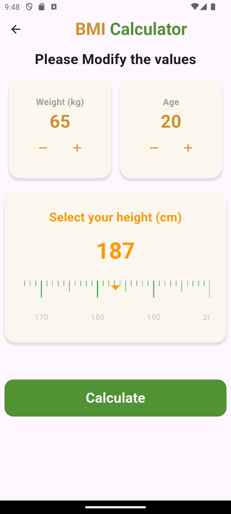

# 🧮 BMI Calculator App

A simple and elegant **Body Mass Index (BMI)** calculator built using **Flutter**.  
It helps users calculate their BMI based on height, weight, age, and gender — with a beautiful blurred dialog interface for the results.

---

## ✨ Features

- 📏 Interactive **Ruler Picker** for selecting height  
- ⚡ Smooth and responsive UI built with **Flutter & Dart**  
- 🌫️ Custom **Blur Dialog** for displaying BMI results  
- 💬 Displays BMI status (Normal, Overweight, Underweight, etc.) with styled labels  
- 🧱 Clean architecture and reusable widgets (AppBar, Button, Cards)  
- 🔁 Navigation argument passing between screens  

---

## 🛠️ Tech Stack

| Category | Tools / Frameworks |
|-----------|--------------------|
| **Framework** | Flutter |
| **Language** | Dart |
| **UI Components** | Material Design, Custom Widgets |
| **Packages** | flutter_ruler_picker, fluttertoast |

---

## 📸 Preview

| Screen 1 | Screen 2 | Screen 3 |
|-----------|-----------|-----------|
|  |  |  |

---

## 🚀 Usage

1. Select **gender**, **height**, **weight**, and **age**  
2. Press the **Calculate** button  
3. View results in a **blurred popup dialog** with BMI value and status  

---

## 💡 Inspiration

This project was built to explore **Flutter UI design**, **state management**, and  
**user-friendly visual feedback**, while maintaining a **clean and modular architecture**.

---

## 📱 Try It Out

Clone the repo and run:

```bash
flutter pub get
flutter run

